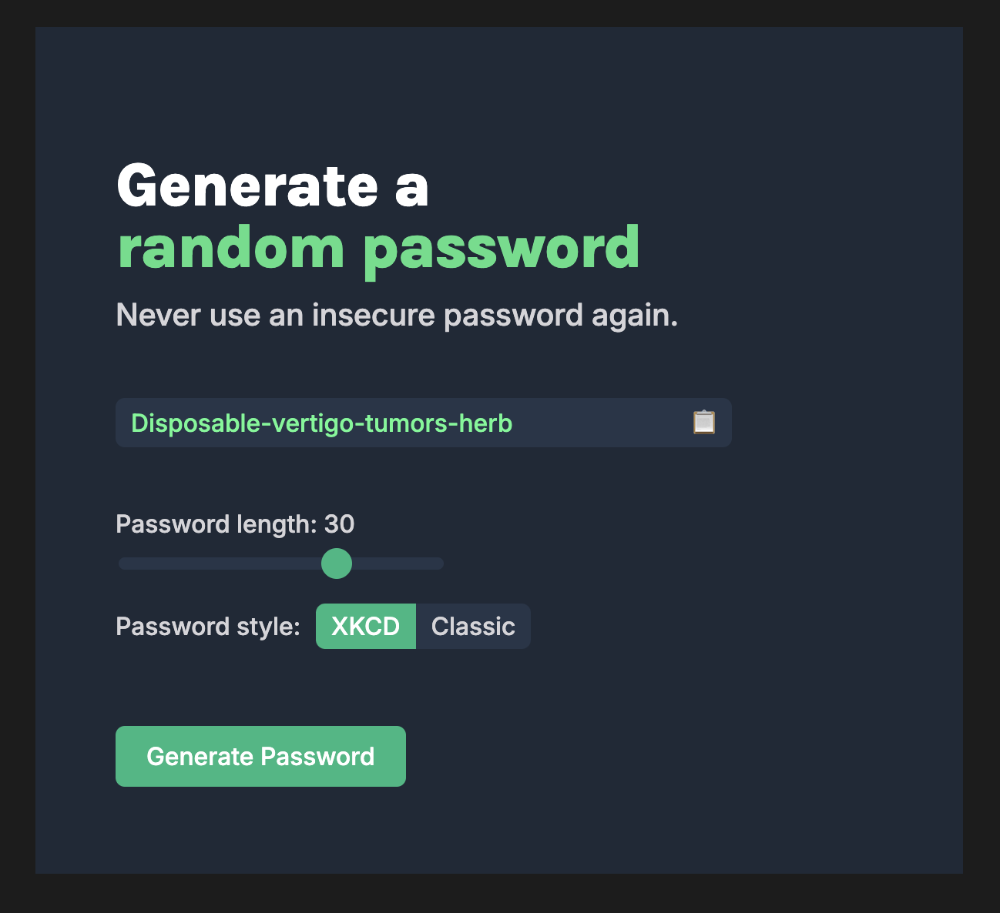

# Password Generator

A simple, interactive password generator web application.

## Features

- Generate random passwords
- Choose between [XKCD-style](https://xkcd.com/936/) and classic passwords
- Adjust password length with a slider
- Copy generated password to clipboard
- Visual feedback for password generation and copying

## Technologies Used

- HTML
- CSS
- JavaScript

## How It Works

The application displays a user interface with options to customize the password generation. Users can select the password style (XKCD or classic), adjust the length using a slider, and generate a new password. The generated password is displayed with a highlight animation, and users can easily copy it to their clipboard.

## Usage

1. Open `index.html` in a web browser
2. Choose between XKCD and classic password styles
3. Adjust the password length using the slider
4. Click "Generate Password" to create a new password
5. Click the clipboard icon to copy the password

## Files

- `index.html`: The main HTML structure
- `style.css`: Styles for the password generator
- `script.js`: JavaScript for password generation functionality
- `wordlists/1password-replacement.txt`: Word list for XKCD-style passwords. Taken from [this](https://github.com/sts10/generated-wordlists/tree/main/lists/1password-replacement) excellent work, further documented [here](https://sts10.github.io/2020/09/30/making-a-word-list.html) 